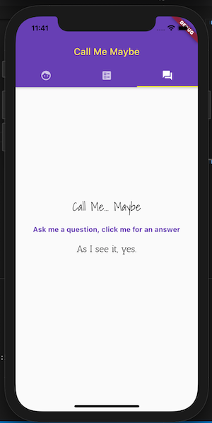

# Call Me Maybe

Screenshots:

    
    

Original Prompt:

The program should be a three-tab application and should be visually styled beyond the intentionally minimum "look and feel" shown above. The program should be responsive to different device orientations, invoke platform services, and support some stateful interaction. The application should:

Display three tabs, consisting of icons, at the top area of the screen.
Tapping any tab should display one of three things: a Business Card, a Resume or a Predictor.
The Business Card should display a photo, name, title, phone number, web site url (e.g., GitHub profile), and email address.
The structure of the layout should be similar to what is shown in the example above.
The information here can be made up, to honor your privacy.
When tapping the phone number, the device's text messaging app should appear.
When tapping the web site url, a web browser should appear and display that web page.
You should use text sizes, styles, fonts, and colors on this screen. For example, a colored non-white background with white fancy text.
Use your photo, or a any avatar photo, instead of the Placeholder shown in the example above.
The Resume should display your name, contact details and other basic resume components. Most importantly, it should display a long list of prior work experience.
Anti-requirement: do not use a ListView widget. 
Your contact details and work experience can be made up, to honor your privacy.
You should use text sizes and styles that are larger/different than the simple example above.
Each "prior position" should consist of job title, company, dates of employment, location, and a brief description.
The visual layout of each "prior position" should be similar to what is shown in the example above.
Ensure that you have enough of these "prior positions" to occupy more than what can fit on the screen.
You should be able to scroll the screen up and down to see more content.
The Predictor should exhibit behavior similar to a "magic eight ball (Links to an external site.)" and playfully predict whether or not you will get called back after an interview.
Anti-requirement: do not use a button widget.
The Predictor screen should display a fun prompt, and a Text widget asking the user to tap for an answer.
The Text widget should be "tappable" and cause the screen to display a new random answer.
There should be eight possible answers, which are entirely up to you.
The application should support all orientations except upside-down.
The layout should be responsive enough to look good and be usable in any orientation.
The content should not be hidden by notches or curved corners of the device screen.
The Business Card and Predictor screens should not cause overflow or require scrolling, in any orientation.
When oriented horizontally, the Resume content should expand horizontally, and still allow for vertical scrolling.

